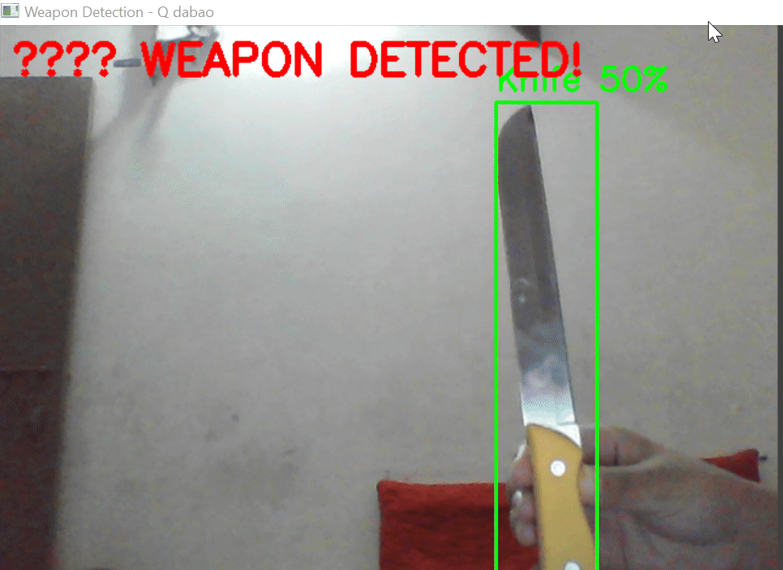
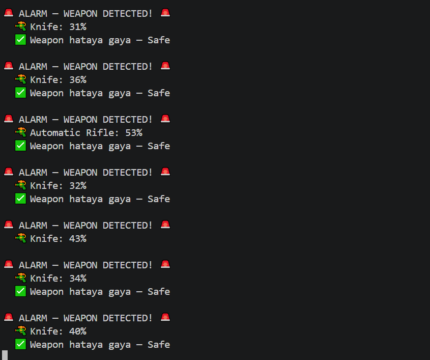

# 🔫 Real-Time Weapon Detection

**A real-time weapon detection system using YOLOv8, with live webcam alerts and an audio alarm on detection.**


---

## Overview

This project detects weapons in real time from a live webcam feed (or static images) using a custom-trained YOLOv8 model, combined with the pretrained COCO model for additional knife detection. When a weapon is detected, the system overlays a bounding box with the weapon type and confidence score, displays an on-screen alert, and triggers an **audible beep alarm** — making it suitable as a proof-of-concept for a surveillance/security alert system.

## ✨ Features

- **Custom-trained detector** — YOLOv8 model trained from scratch on a 9-class weapon dataset
- **Dual-model detection** — combines the custom weapon model with the pretrained YOLOv8 COCO model (class 43: knife) for improved knife detection accuracy
- **Real-time webcam detection** — live video feed with bounding boxes, labels, and confidence scores drawn on each frame
- **Audio alarm** — triggers a beep sound (via a background thread, so it doesn't block the video feed) when a weapon first appears, and stops once the frame is clear
- **Static image testing** — batch-test the model against a folder of sample images and save annotated outputs
- **On-screen status indicator** — green "✅ Safe" / red "🚨 WEAPON DETECTED!" banner overlaid on the live feed

## 🎯 Detected Classes

The custom model is trained to detect **9 weapon classes**:

`Automatic Rifle` · `Bazooka` · `Grenade Launcher` · `Handgun` · `Knife` · `Shotgun` · `SMG` · `Sniper` · `Sword`

## 🖼️ Screenshots

**Live webcam detection** — bounding box, label, and confidence score drawn in real time:



**Terminal alert log** — each detection triggers a console alarm with the detected weapon and confidence, and confirms once the frame is clear:



## 🛠️ Tech Stack

| Layer | Technology |
|---|---|
| Object Detection | YOLOv8 (Ultralytics) |
| Video/Image Processing | OpenCV |
| Alerting | Python `winsound` + `threading` |

## 📁 Project Structure

```
weapon-detection/
├── Detection.py            # Batch test on static sample images
├── Webcam_detection.py     # Real-time webcam detection with alarm
├── test_cam.py             # Webcam connectivity check
├── validate.py             # Model validation script
├── dataset.yaml            # Dataset class definitions
├── yolov8n.pt               # Pretrained YOLOv8 base model (used for knife detection)
├── runs/detect/weapon_detector/weights/best.pt   # Custom-trained weapon detection model
├── test/                    # Sample test images/GIFs
└── screenshots/
```

> Note: the training dataset and intermediate training run artifacts are excluded from this repo (see `.gitignore`) since they're not needed to run the project — only the final trained model (`best.pt`) is included.

## 🚀 Getting Started

### Prerequisites
```bash
pip install ultralytics opencv-python
```
> `winsound` is built into Python on Windows; the alarm feature is Windows-only as written.

### Run on static test images
```bash
python Detection.py
```

### Run real-time webcam detection
```bash
python Webcam_detection.py
```
Press **Q** to quit.

## ⚠️ Disclaimer

This project was built for educational purposes as a computer vision / object detection exercise. It is a proof-of-concept, not a production-grade security system, and hasn't been evaluated for real-world deployment accuracy or false-positive rates.

---

<p align="center">Built with ❤️ by <a href="https://github.com/uroojbuilds">Urooj</a></p>
